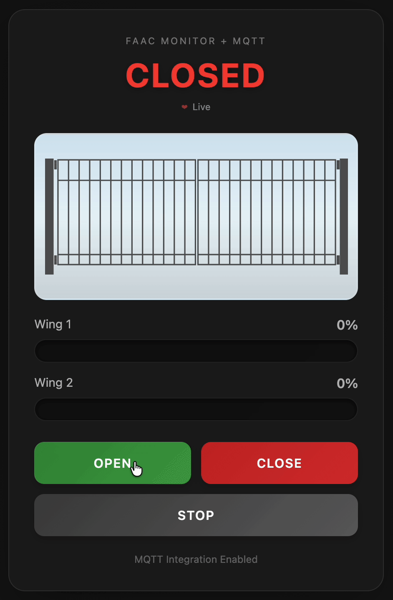
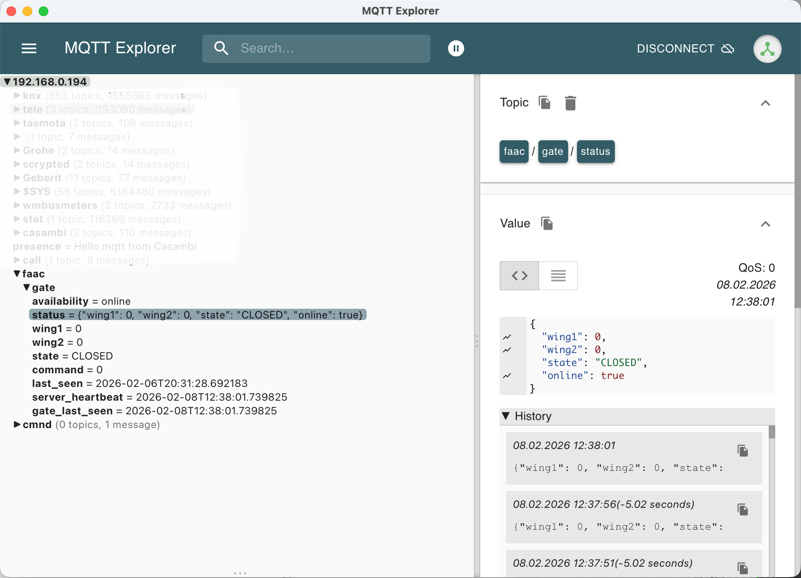

# FAAC E145 Gate Connect

[](LICENSE)
[](https://python.org)

Open-source Python gateway for FAAC E145 gate controllers with MQTT, OpenHAB, and Home Assistant integration.



## Features

- Control FAAC E145 gates via serial connection
- Real-time position monitoring (0-100% for both wings)
- Web interface with live updates
- **MQTT integration** for home automation
- **REST API** for HTTP-based control and monitoring
- Commands: Open, Close, Stop, Position (0-100%)
- Status publishing: position, state, availability
- Home Assistant & OpenHAB compatible

## Quick Start

### Basic Usage (Web UI only)

```bash
pip install -r requirements.txt
python3 faac_gateway_standalone.py
```

Open http://localhost:5000 in your browser.

### With MQTT Support

```bash
pip install -r requirements.txt
cp config/config.yaml.example config/config.yaml
# Edit config.yaml with your MQTT broker settings
python3 faac_gateway_mqtt.py -c config/config.yaml
```

## MQTT Topics

Subscribe to status updates:
- `faac/gate/status` - Complete status (JSON)
- `faac/gate/state` - Gate state (OPEN/CLOSED/MOVING/STOPPED)
- `faac/gate/wing1` - Wing 1 position (0-100%)
- `faac/gate/wing2` - Wing 2 position (0-100%)
- `faac/gate/availability` - Connection status (online/offline)

Publish commands:
- `faac/gate/command` - Send commands: `open`, `close`, `stop`



See [MQTT documentation](docs/MQTT.md) for detailed integration guides.

## REST API

Simple HTTP endpoints for gate control:

```bash
# Get status
curl http://localhost:5000/api/status

# Send command
curl -X POST http://localhost:5000/api/command \
     -H "Content-Type: application/json" \
     -d '{"command": "open"}'

# Health check
curl http://localhost:5000/api/health
```

See [REST API documentation](docs/REST_API.md) for complete API reference, authentication, and examples.

## Documentation

- **[REST API Guide](docs/REST_API.md)** - RESTful HTTP API for gate control and status
- **[FAAC Software Guide](docs/FAAC_SOFTWARE.md)** - Official FAAC software download, VirtualHere setup, deployment options
- **[USB Setup Guide](USB_SETUP.md)** - USB driver configuration for FAAC E145 controller
- **[Installation Guide](scripts/README.md)** - Systemd service setup and log management
- **[MQTT Setup](MQTT_SETUP.md)** - MQTT broker configuration
- **[OpenHAB Integration](openhab/README.md)** - OpenHAB configuration and usage
- [MQTT Integration Guide](docs/MQTT.md) - Home Assistant, OpenHAB, Node-RED
- [Full Documentation](docs/)

## Examples

```bash
# Test MQTT functionality
python3 examples/mqtt_test.py

# Simple status subscriber
python3 examples/mqtt_simple.py

# Send commands via MQTT
mosquitto_pub -t 'faac/gate/command' -m 'open'
```

## Related Projects

- [gatecontrol](https://github.com/owahlen/gatecontrol) - Gate control solution for FAAC E124 (protocol compatibility with E145 unknown)
